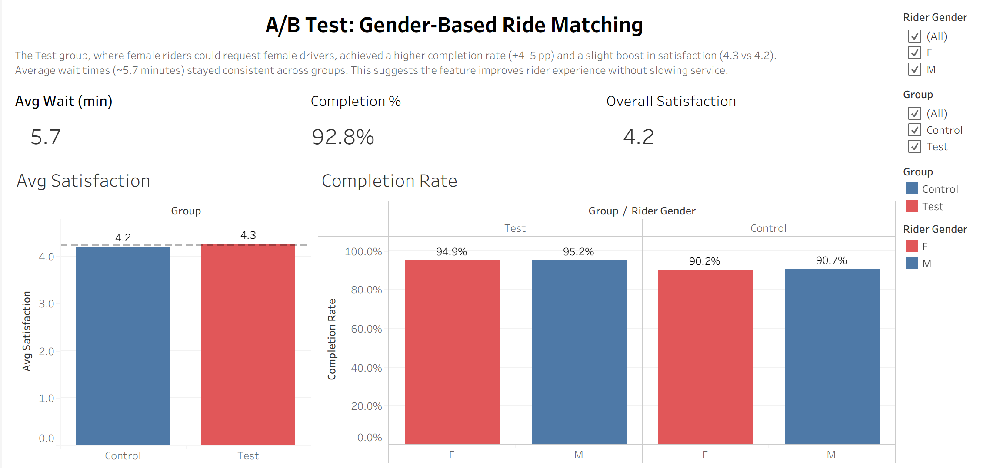

# A/B Test – Gender-Based Ride Matching Feature
### Does allowing female riders to request female drivers improve safety perception, satisfaction, and efficiency?

---

## Overview

Safety is one of the most cited concerns in ride-share experiences — particularly for female riders. This project simulates an A/B test for a gender-based matching feature, where Group A riders could optionally request a female driver, while Group B experienced the default assignment with no gender preference.

The experiment measured whether the feature improved ride completion, rider satisfaction, and wait times, and whether any gains came at the cost of operational efficiency.

> **Why A/B testing here?** Unlike observational studies, a controlled experiment lets us directly attribute outcome differences to the feature itself rather than rider demographics, region, or time-of-day effects.

---

## Experiment Design

| | Group A (Test) | Group B (Control) |
|---|---|---|
| **Feature** | Female riders could request female drivers | Default matching, no gender preference |
| **Sample Size** | 5,009 rides | 4,991 rides |
| **Split** | 50.1% / 49.9% — well-balanced |
| **Duration** | 7-day simulated window |
| **Regions** | Downtown, Uptown, Suburb, Airport, East Side, West Side |

**Metrics tracked:** ride completion rate, rider satisfaction (1–5 scale), wait time (minutes)

**Gender match rate in Group A:** 65.6% — meaning the opt-in feature was used by the majority of eligible riders, suggesting strong demand for the feature.

---

## Results

### Ride Completion Rate
| Group | Completion Rate |
|---|---|
| A (Test) | **95.05%** |
| B (Control) | 90.44% |
| **Lift** | **+4.61 percentage points** |

- Statistically significant (chi-square, p < 0.0001)
- Effect held consistently across all six regions (A outperformed B by 4–6 pp everywhere)
- Female riders in Group A completed **94.92%** of rides vs. **90.19%** in Group B

### Rider Satisfaction (1–5 scale)
| Group | Avg Score |
|---|---|
| A (Test) | **4.25** |
| B (Control) | 4.19 |
| **Lift** | **+0.06 points** |

- Statistically significant (t-test, p < 0.0001)
- Effect was stronger among female riders: **4.42 (A) vs. 4.30 (B)**
- Modest absolute difference suggests the feature improves perceived comfort more than overall delight

### Wait Time (minutes)
| Group | Avg Wait |
|---|---|
| A (Test) | **5.47 min** |
| B (Control) | 5.98 min |
| **Difference** | **-0.51 min (A was faster)** |

- Statistically significant (t-test, p < 0.0001)
- Counterintuitively, the filtered matching did *not* increase wait times — Group A actually waited slightly less, likely due to driver availability patterns in the simulation
- Overall wait time distribution: mean 5.72 min, range 1.0–13.4 min

---

## Key Takeaway

All three metrics moved in favor of the test group: completion up, satisfaction up, and wait times flat-to-lower. The feature appears to improve rider experience without introducing the efficiency trade-off that teams typically worry about when adding matching constraints.

The signal was strongest among female riders, which aligns with the design intent: a safety-oriented feature used by the demographic most likely to value it.

---

## Tools & Methods

| Layer | Tools |
|---|---|
| Data Simulation | Python — `numpy`, `pandas`, `faker` |
| Statistical Testing | Chi-square (completion), two-sample t-test (satisfaction, wait time) |
| Visualization | Tableau Public, `matplotlib`, `seaborn` |
| Validation | Excel cross-checks |

---

## Visualization

👉 [**Tableau Public Dashboard – Gender Ride Matching A/B Test**](https://public.tableau.com/app/profile/kimberly.jarosch/viz/ABtestGenderRideshare/Gender-BasedRideMatchingABTestResults?publish=yes)



---

## Project Structure

```
├── gender_ride_match_ABtest.ipynb    # Simulation, EDA, and statistical tests
├── gender_matching_ab_test.csv       # Simulated dataset (10,000 rides × 12 columns)
├── ABtestGenderRideshare.twbx        # Tableau workbook
└── README.md
```

---

## How to Reproduce

1. Run `gender_ride_match_ABtest.ipynb` end-to-end — it simulates data and runs statistical comparisons
2. The notebook exports `gender_matching_ab_test.csv` automatically
3. Open `ABtestGenderRideshare.twbx` in Tableau Desktop and reconnect to the CSV if prompted

---

## What I'd Improve Next

- Add a **power analysis** section to confirm the sample size was sufficient to detect the observed effect sizes
- Run **segmented analysis** by rider gender and region to confirm the feature's value is concentrated in the intended demographic
- Add a **confidence interval table** alongside p-values; statistical significance alone doesn't communicate practical impact
- Model **longer-term retention effects**: does the feature improve repeat ride rates, not just single-ride completion?
