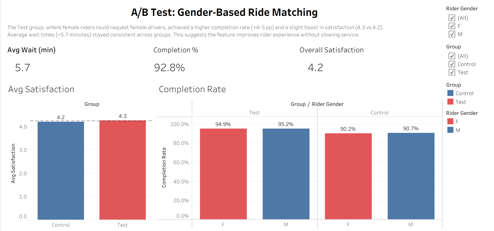

# A/B Test Dashboard – Gender-Based Ride Matching

This project simulates and analyzes the impact of a **gender-based ride matching feature** in a ride-sharing app.  
The feature allows female riders to request female drivers, with the goal of improving rider **safety, satisfaction, and ride completion rates**.  

---

## Project Overview
The analysis was designed as an **A/B test**:  
- **Test Group (A)** – Female riders could request female drivers.  
- **Control Group (B)** – Default experience, no gender preference.  
- **Sample Size** – 10,000 simulated rides (5,000 per group).  
- **Metrics Evaluated**:  
  - Ride completion rate  
  - Rider satisfaction score (1–5)  
  - Average wait time (minutes)  

---

## Tools & Methods
- **Python (Pandas, NumPy, Matplotlib)** – Simulated dataset, cleaning, and statistical testing  
- **SQL (SQLite/PostgreSQL)** – Summarization queries and aggregations  
- **Tableau Desktop Public Edition** – Dashboard creation and visualization  
- **Excel** – Quick summaries and validation  

---

## Dashboard Preview

  

➡️ **[Download the Tableau Dashboard (.twbx)](ABtestGenderRideshare.twbx)**  
*(Open in Tableau Desktop or free Tableau Reader to interact with it.)*

---

## Key Insights
- **Completion Rates**  
  - Control Group: ~90%  
  - Test Group: ~95%  
  - ✅ The feature increased completion by **+4–5 percentage points**, especially for female riders.  

- **Satisfaction**  
  - Control Group: 4.2  
  - Test Group: 4.3  
  - ✅ Slight improvement in satisfaction for the Test group.  

- **Wait Times**  
  - Average ~5.7 minutes in both groups  
  - ✅ No increase in wait times despite the new matching criteria.  

- **Correlation**  
  - Scatter plot shows **little relationship between wait time and satisfaction** in either group.  

---

## Conclusion
The A/B test suggests that introducing a **gender-based ride matching feature** improves rider experience and safety:  
- Higher ride completion rates  
- Slightly better satisfaction  
- No meaningful increase in wait times  

**Recommendation:** This feature could be considered for rollout at scale, as it improves outcomes without sacrificing efficiency.  

